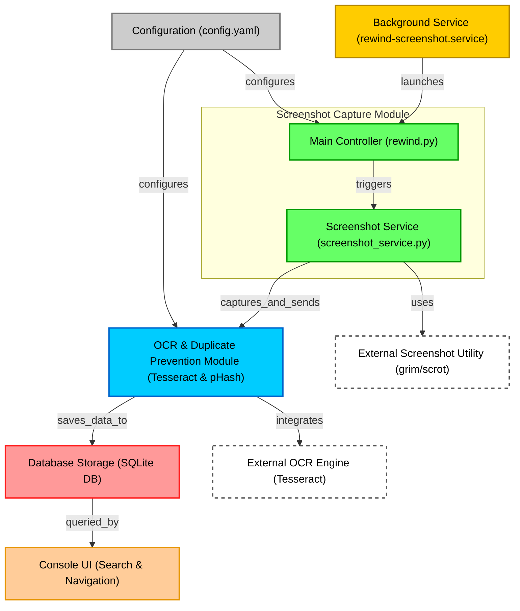

# Rewind ⬅️📽️

Rewind is an application that periodically takes screenshots of your computer screen, recognizes the text in these images, and allows you to search for screenshots by the text on them or by the time of creation. It also intelligently prevents duplicate screenshots to save storage space.

## Text search


## Timeline


## Features 🚀

- **Automatic screen capture**: Takes screenshots at a set frequency.
- **Text Recognition**: Uses Tesseract OCR to extract text from screenshots.
- **Text Search**: Saves screenshots and extracted text in the SQLite database.
- **Duplicate Prevention**: Uses perceptual hashing (pHash) and text similarity to prevent saving near-duplicate screenshots.
- **Console Application**: Allows you to search by screenshots in the console.

## Diagram 📊


## Installation 🛠️

To install Rewind on Arch Linux, follow these steps:

1. **Clone the repository:**

    ```bash
    git clone https://github.com/Forwall100/rewind.git
    cd rewind
    ```

2. **Run the installation script:**

    ```bash
    ./setup.sh
    ```

    This script will execute:
    - Installation of necessary dependencies.
    - Build and install the package.
    - Enabling and launching the Rewind service to create screenshots.

## Usage 🎮

### Launch

To launch the Rewind client application, run:

```bash
rewind
```

This will open a console application where you can search for screenshots by text or the time they were created.

### Navigation in the client interface

- **Search**: Enter your query and use the arrows to select the desired screenshot.
- **Timeline Mode**: Press `Tab` to switch the timeline mode. Use the left and right arrows to navigate through different timestamps.
- **Open Image**: Press `Enter` to open the selected screenshot.
- **Exit**: Press `Esc` to exit the application.

## Data storage 💾

Rewind stores its data in the SQLite database located at the path `~/.config/rewind/screenshots.db`. Screenshots are saved as binary data, and the text extracted from them is saved as plain text. The perceptual hash (pHash) of each image is also stored for efficient similarity checking.

## Configuration ⚙️

The configuration file is located at `~/.config/rewind/config.yaml`. You can configure the following settings:

- **languages**: Languages for text recognition. Default is `eng+rus`. Multiple languages are indicated by a '+'.
- **max_db_size_mb**: Maximum size of the database in megabytes. Default is `20000`.
- **screenshot_period_sec**: Period between screenshots in seconds. Default is `30`.
- **similarity_threshold**: Threshold for image similarity (0.0 to 1.0). Default is `0.9`. This threshold determines how similar two images must be to be considered duplicates. The value ranges from 0.0 to 1.0, where 1.0 means the images must be identical. A value of 0.9 allows for slight differences (like cursor movement or clock changes) while still catching most duplicates.
- **text_similarity_threshold**: Threshold for text similarity (0.0 to 1.0). Default is `0.8`. Similar to the image similarity threshold, but for the extracted text. This helps catch cases where the images might be slightly different, but the text content is essentially the same. A value of 0.8 allows for small differences in recognized text while still catching most duplicates.

### Example of `config.yaml`

```yaml
languages: "eng+rus"
max_db_size_mb: 20000
screenshot_period_sec: 30
similarity_threshold: 0.9
text_similarity_threshold: 0.8
```

> [!CAUTION]
> Restart systemd service `rewind-screenshot.service` to make the config changes take effect

## Systemd Service 🔄

The background service is managed by systemd. The service file `rewind-screenshot.service` is installed in `/usr/lib/systemd/user/`.

To manually start or stop the service, use:

```bash
systemctl --user start rewind-screenshot.service
systemctl --user stop rewind-screenshot.service
```

To enable the service when logging in:

```bash
systemctl --user enable rewind-screenshot.service
```

## Dependencies 📦

Rewind depends on the following packages:

- `python`
- `python-pillow`
- `python-pytesseract`
- `python-yaml`
- `python-numpy`
- `python-scipy`
- `python-levenshtein`
- `tesseract`
- `tesseract-data-eng`
- `tesseract-data-rus`
- `grim` (for Wayland)
- `scrot` (for X11)

These dependencies are automatically installed during the configuration process. To add new OCR languages, you need to install the appropriate tesseract-data-[langcode] packages and edit the config.

## Delete 🗑️

To remove Rewind, follow these steps:

1. **Stop and disable the service:**

    ```bash
    systemctl --user stop rewind-screenshot.service
    systemctl --user disable rewind-screenshot.service
    ```

2. **Delete the installed files:**

    ```bash
    sudo rm /usr/bin/rewind
    sudo rm /usr/lib/systemd/user/rewind-screenshot.service
    sudo rm -rf ~/.config/rewind
    ```

3. **Delete the package**

    ```bash
    sudo pacman -R rewind
    ```
